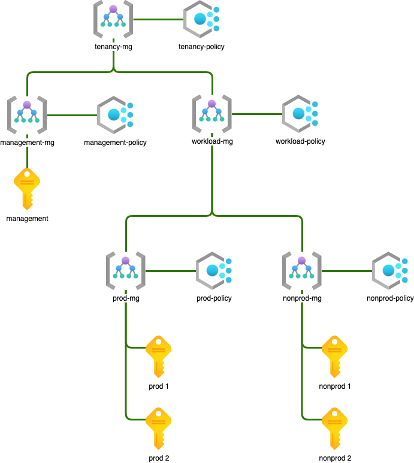
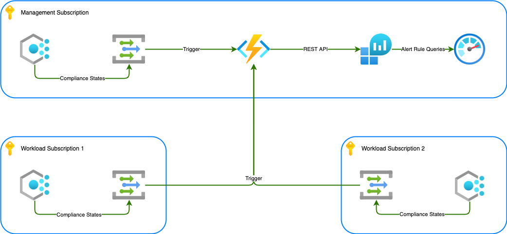

# Azure Policy as Code - Using Terraform & Terragrunt

This repo is all about Azure Policy as Code. It utilises [Terraform](https://www.terraform.io/) and its associated
AzureRM modules to allow the deployment of the policies and [Terragrunt](https://terragrunt.gruntwork.io/) to assist in keeping
your code [DRY](https://en.wikipedia.org/wiki/Don%27t_repeat_yourself).

This whole repo is combination of three standalone solutions combined to allow for a one-stop-shop
when it comes to policy development, policy deployment and monitoring compliance state. I need to
provide credit to the following projects:

- [Tools Container](https://github.com/star3am/tools-container) - Rolls all development and deployment
  tools into one container. Provides a solution that can be run anywhere regardless of the underlying
  infra. All that is required is Docker and Docker-Compose.
- [Monitoring Azure Policy Compliance State](https://blog.tyang.org/2021/12/06/monitoring-azure-policy-compliance-states-2021-edition/) -
  A solution that helps you keep an eye on policy state changes, and allows you to build any required
  workflow around your state changes of choice.
- [Azure Policy as Code](https://github.com/rahuljai24/terraform-azurerm-policy-as-code) - This solution has done all the hard work
  and is what inspired me to create this "all-in-one" solution.

This solution attempts to roll all of the above patterns into one solution and will allow you to implement Azure Policy for any new or existing
Azure Tenancy. Please keep in mind, this is NOT a landing zone but a framework that will allow you to implement Azure Policy in a hierarchial
pattern starting management groups. In theory you should be able to use this framework on any Azure Tenancy where you can implement a management
group structure or already have one in place, without the need to make any invasive changes.

It provides the ability to selectively apply policies and their effects at the broadest level, management groups, all the way down to resource level if required,
and all of this in a code base, protected by source control that can be audited as well as incorporated into any workflow.

The solution should benefit any Dev(Sec)Ops / SRE / IT Governance people (anyone actually) that have a need for better control and 
visibility of the compliance state of their Azure environments. Because all of the configuration is contained in a code repository you can
easily build a workflow to accommodate your unique requirements when it comes to auditability etc.

Example use cases could be:

- Audit then enforce governance requirements on old click-ops environments
- Already have a landing zone pattern implemented but want the governance separated from the infrastructure.
- Retro fitting governance and compliance into an already existing landing zone managed with IaC

The base structure looks as follows:



You have the ability to apply a base set of policies at the top level, then as required apply more restrictive ones depending on workload requirements. Exemptions follow the
same logic, it gets applied at whichever level you require it to be.

## Policies - How it works in this repo

### Policy Definitions Module

It all starts with the policy definitions, they are housed in category specific folders in the [policies](./policies/) folder and follow the 
[Azure Policy Definition Structure](https://docs.microsoft.com/en-us/azure/governance/policy/concepts/definition-structure). It makes it easier to assign
a policy definition to the main/master/parent management group, this gives us the opportunity to use this policy definition in any child object.

Once you have created your policy json file according to the guidelines you then need to assign it to your management group of choice, this example will be the 
root management group. Create a new folder with the same name as your policy name in [./environment/policy/mg-root/policy-definitions/](./environment/policy/mg-root/policy-definitions/).

Place two empty files in the newly created folder, `module.yaml` and `terragrunt.hcl`. Populate the `module.yaml` file with your policy details:

```yaml
policy_name: whitelist_regions
display_name: "Whitelist Azure Regions"
policy_category: General
```

It is important that the attribute `policy_name` matches the policy definition file name, excluding the `.json` extension. Then copy and paste this bit of boilerplate into the
`terragrunt.hcl` file:

```hcl
terraform {
  source = "${get_repo_root()}/modules/policy-definition//."
}

include {
  path = find_in_parent_folders()
}

inputs = {
  repo_root = get_repo_root()
}
```

Quick explanation of the Terragrunt blocks [here](#terragrunt-blocks).

### Policy Initiative Module

A Policy initiative is a [collection of policies](https://learn.microsoft.com/en-us/azure/defender-for-cloud/security-policy-concept#what-is-a-security-initiative) that works towards a 
specific goal. It is also not a bad idea to assign an initiative to the root management group, but that is your choice. To assign an initiative to a management group, create a folder with
the name of your initiative in management group folder inside the `policy-initiatives` folder. This will also require a `module.yaml` and `terragrunt.hcl` file. Populate the `module.yaml`
file with your initiative details:

```yaml
initiative_name: "resource_limitations"
initiative_display_name: "[Resources]: Resource Limitations"
initiative_description: "Resource related limitations - SKUs, locations, etc."
initiative_category: "Resources"
```

The Terragrunt file gets an additional *dependency* block. The file will look something like this:

```hcl
terraform {
  source = "${get_repo_root()}/modules/policy-initiative//."
}

include {
  path = find_in_parent_folders()
}

dependency "whitelist_regions" {
  config_path = "${get_parent_terragrunt_dir()}/policy/mg-root/policy-definitions/whitelist-regions"
  mock_outputs = {
    definition = {
      "description"         = ""
      "display_name"        = "Mock"
      "id"                  = "/subscriptions/${uuid()}/providers/Microsoft.Authorization/policyDefinitions/mock"
      "management_group_id" = ""
      "metadata"            = "{}"
      "mode"                = "All"
      "name"                = "mock"
      "parameters"          = "{}"
      "policy_rule"         = "{}"
      "policy_type"         = "Custom"
      "role_definition_ids" = tolist([])
      "timeouts"            = {}
    }
  }
}

inputs = {
  member_definitions = [
    dependency.whitelist_regions.outputs.definition
  ]
}
```

### Policy Initiative Assignment Module

This is where the rubber hits the road, up until now you have only create either policies or initiatives but they are not doing anything yet. To make them of any use
to you, they need to be assigned to something and in this repo our something of choice is a management group. You follow the same concept as the policy definition and initiative
by adding a `module.yaml` and `terragrunt.hcl` file to folder with the same name as your Initiative nested under the `policy-assignment` folder.

```yaml
---
assignment_parameters:
  listOfRegionsAllowed:
    - global
    - australiacentral
    - australiaeast
    - australiasoutheast
```

```hcl
terraform {
  source = "${get_repo_root()}/modules/policy-set-assignment//."
}

include {
  path = find_in_parent_folders()
}

dependency "assignment_resource_limitations" {
  config_path = "${get_parent_terragrunt_dir()}/policy/mg-root/policy-initiatives/resource-limitations"
  mock_outputs = {
    initiative = {
      description             = "Mock descriptiom."
      display_name            = "[Mock]: Mock"
      id                      = "/subscriptions/${uuid()}/providers/Microsoft.Authorization/policySetDefinitions/mock"
      management_group_id     = ""
      metadata                = "{}"
      name                    = "mock_${uuid()}"
      parameters              = "{}"
      policy_definition_group = toset([])
      policy_definition_reference = tolist([
        {
          parameter_values     = "{}"
          policy_definition_id = "/subscriptions/${uuid()}/providers/Microsoft.Authorization/policyDefinitions/mock"
          policy_group_names   = toset(null)
          reference_id         = "aa00a000a0000a00a000"
        },
      ])
      policy_type = "Custom"
      timeouts    = {}
    }
    role_definition_ids = [
      "/providers/microsoft.authorization/roleDefinitions/${uuid()}",
      "/providers/microsoft.authorization/roleDefinitions/${uuid()}",
    ]
  }
}

inputs = {
  initiative          = dependency.assignment_resource_limitations.outputs.initiative
  role_definition_ids = dependency.assignment_resource_limitations.outputs.role_definition_ids
}
```

## Monitoring compliance, especially changes in the compliance state

The Policy Compliance dashboard in Azure looks pretty but I am sure you want to know in a more timely manner
when compliance states change on resources, especially when they change from being compliant to non-compliant.

To help with this, this solution includes a System Event that provides us with Policy State Change Events that 
triggers a function that writes these to a Log Analytics Workspace (LAW). With this you can expand on the Function App
to do certain things when specific changes are detected or you can create alerts from the LAW as required. This is what
the solution looks like:



## How to contribute

The suggested way to get started is to use [VS Code](https://code.visualstudio.com/), [DevContainers](https://marketplace.visualstudio.com/items?itemName=ms-vscode-remote.remote-containers),
[Docker](https://www.docker.com/) and [Docker-Compose](https://docs.docker.com/compose/).

Ensure you have the above mentioned software installed on your hardware of choice and then:

- Clone this repo locally
- Now open the repo in the container, see the [tutorial](https://code.visualstudio.com/docs/devcontainers/tutorial) on devcontainers.
- Once the container is launched all that is left to do is run [run.sh](./run.sh) and start developing

## Terragrunt blocks

### terraform

```hcl
terraform {
  source = "${get_repo_root()}/modules/module-name//."
}
```

Pretty self explanatory, it locates the Terraform module source

### include

```hcl
include {
  path = find_in_parent_folders()
}
```

Include all the Terragrunt config in the parent folders

### inputs

```hcl
inputs = {
  this_value = that_value
}
```

Terraform variable values that can only be determined with function execution on this level or from upstream dependencies, where we rely on output from other modules.

### dependency

```hcl
dependency "denied_resources" {
  config_path = "${get_parent_terragrunt_dir()}/policy/mg-root/policy-definitions/denied-resources"
  mock_outputs = {
    definition = {
      "description"         = ""
      "display_name"        = "Mock"
      "id"                  = "/subscriptions/${uuid()}/providers/Microsoft.Authorization/policyDefinitions/mock"
      "management_group_id" = ""
      "metadata"            = "{}"
      "mode"                = "All"
      "name"                = "mock_${uuid()}"
      "parameters"          = "{}"
      "policy_rule"         = "{}"
      "policy_type"         = "Custom"
      "role_definition_ids" = tolist([])
      "timeouts"            = {}
    }
  }
}
```

Note the modules you are dependent on here and if you rely on any of the outputs it produces, it is good to add a mock output for these. This will ensure
that your initial plan when **no** outputs are available does not fail due to them being missing.

## Terragrunt variable substitution

Terragrunt allows us to provide default values for variables at the base of our solution and the ability to override these values as we need. We achieve this with some
setup in the base [terragrunt.hcl](./environment/terragrunt.hcl) file, with this few lines of code:

```hcl
inputs = merge(
  { workload = element(split("/", path_relative_to_include()), 0) },
  try(yamldecode(file(find_in_parent_folders("common.yaml"))), {}),
  try(yamldecode(file(find_in_parent_folders("environment.yaml"))), {}),
  try(yamldecode(file(find_in_parent_folders("management_group.yaml"))), {}),
  try(yamldecode(file(find_in_parent_folders("subscription.yaml"))), {}),
  try(yamldecode(file(find_in_parent_folders("location.yaml"))), {}),
  try(yamldecode(file("${path_relative_to_include()}/module.yaml")), {}),
)
```

What this piece of code does, is it will look for any of these files between the base folder and the current folder (where the code is being executed), and as it finds these
merge them in the order shown above (top to bottom). Example, *common.yaml* will contain `assignment_effect: "Audit"` and then *module.yaml* will contain `assignment_effect: "Deny"`. In this scenario the policy that gets deployed at current level where this value is different will be deployed with a `Deny` effect, all other policies that does not have this value set at their level
will be deployed with `Audit` effect.
